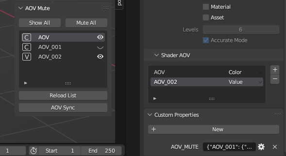

# AOVMute

BlenderのAOV出力がCompositingのUseNodesをOFFにしても止まらない(＝データコピーで時間がかかる)のですが、AOVの出力を止めようとすると削除以外に方法がありません(Blender3.4.1現在)

数個のAOVで1秒程度しかレンダリング時間が増えないといえど、動画で3000枚(100秒)もレンダリングすれば1時間近くレンダリング時間が延びるわけで、仮出力で調整している最中には結構な負担になってしまいます。

時間がかかるからってAOVを削除してしまうと復活させるのがやっぱりメンドウなので、これをなんとかしようというのがこのアドオンの目的です。

## 使い方
このアドオンはFreePencilアドオンを快適に使うために作成されました。なのでUIパネルはFreePencilグループ内に配置されます。

最初にAOVを設定してSyncボタンを押して下さい、UIのリストに現在のAOVが反映されます。

その後はUIパネルのAOVの有効／無効を設定してSyncボタンを押せばAOVの状態を変更させることができます。AOVから設定が削除されてしまいますが、アドオンのリストには残っている(カスタムプロパティに保存)のでアドオンのリストで有効に戻してSyncボタンを押せばAOVが復活します。

AOVを追加したり削除したり設定(Color/Value)を変えたりした時もSyncボタンを押してください。AOVの設定がアドオンに反映されます。

ViewLayer切り替え時は、ReloadListボタンを押せばAOVに影響を与えずにアドオンのリストを作り直すことができます。

### 他のViewLayerのAOV情報を一気に持ってきたい場合
1. 転送元となるViewLayerのAOVをすべてMuteにする
1. CustomPropertyのAOV_MUTEをコピーする
1. 転送先のViewLayerのCustomPeropertyにAOV_MUTE(String)を作ってペーストする
1. アドオンのリストをReloadボタンを押して更新する
